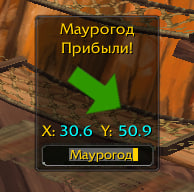

1. Переименовать bcsPointTo-main в bcsPointTo
2. Закинуть в \Interface\AddOns
3. Чтобы включить отображение аддона нужно ввести в чат /pt on
4. Чтобы выключить отображение аддона нужно ввести в чат /pt off
5. Чтобы активировать/деактивировать перемещение рамки аддона нужно ввести в чат /pt lock
6. Чтобы выбрать определенного участника группы в качестве отслеживаемого компасом, нужно кликнуть на поле ввода прямо под координатами в окне фрейма и вписать ник персонажа.
 

  
   
  <em>Пример введённого во фрейм ника</em>

7. Для стабильной работы аддона нужно каждый раз при входе В ИГРУ(и при намерениях использовать аддон) писать /pt on. Даже не смотря на то что окно может быть активно(если ранее не выключали с помощью /pt off), оно все равно не будет корректно работать.
8. Если новая зелёная стрелочка не нравится - можете переименовать файл Art/bcsArrow - Copy.tga в просто bcsArrow.tga но предыдущий файл придется переименовать во что-то другое для сохранения уникальности имён в рамках одной папки.

